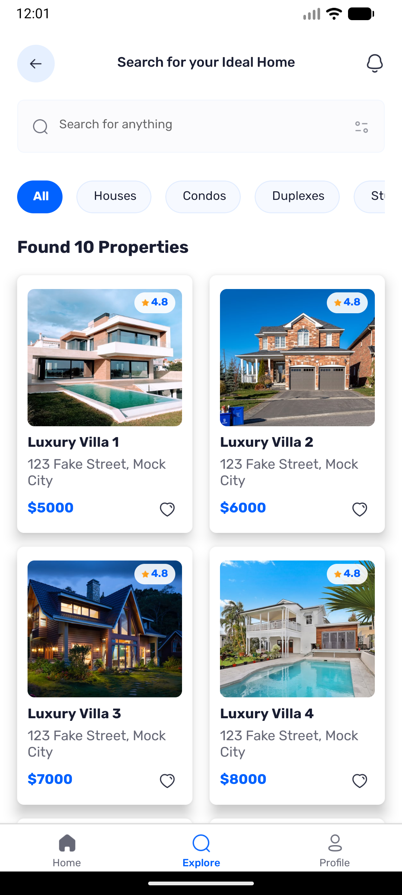

# trurEstate Application Documentation

trurEstate is a state-of-the-art real estate application. It provides a comprehensive suite of tools for exploring properties, viewing details, and managing user profiles.

## 1. Authentication
The app features a simple and elegant sign-in screen to authenticate users before they explore properties.

| Sign In |
|:---:|
|  |

## 2. Home / Dashboard
The main hub where users can see latest featured properties, recommended homes, and quick filters.

| Home Screen |
|:---:|
|  |

## 3. Explore Properties
A dedicated screen to search and filter through all available real estate listings.

| Explore |
|:---:|
|  |

## 4. Property Details
Detailed view of a selected property, including image galleries, agent information, reviews, and facilities.

| Property Details |
|:---:|
|  |

## 5. User Profile
A personalized space where users can manage their account settings and view their details.

| Profile |
|:---:|
|  |

---

*This application highlights advanced UI/UX design patterns, seamless state management, and fluid animations for real estate browsing.*
