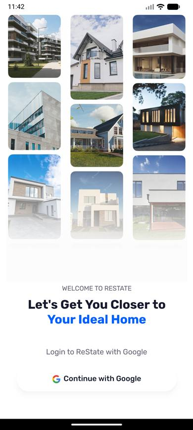
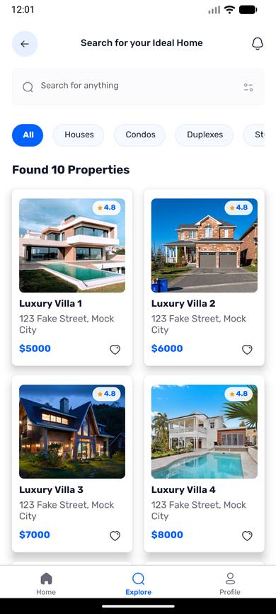
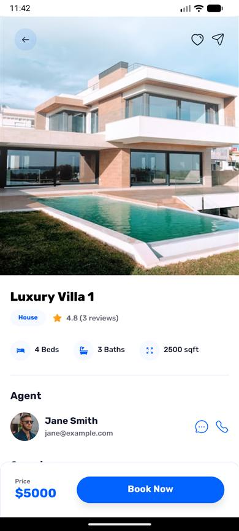
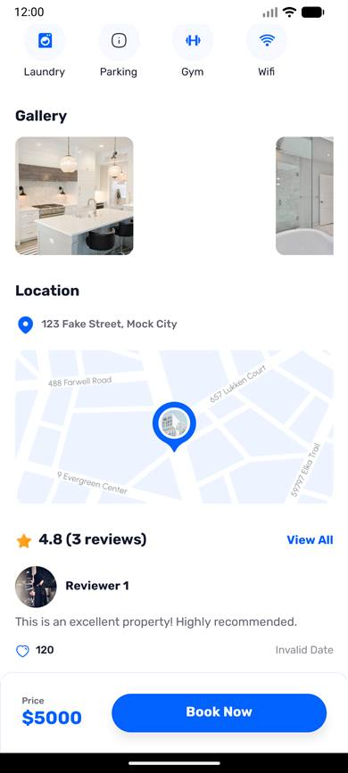
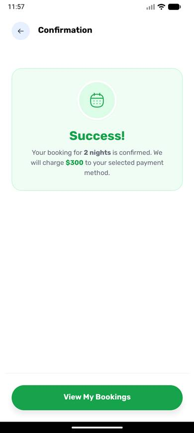
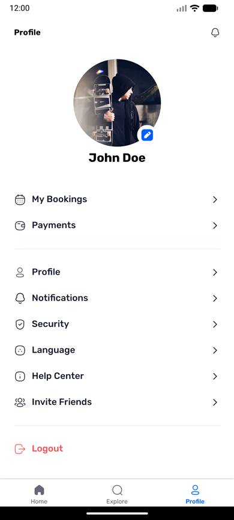
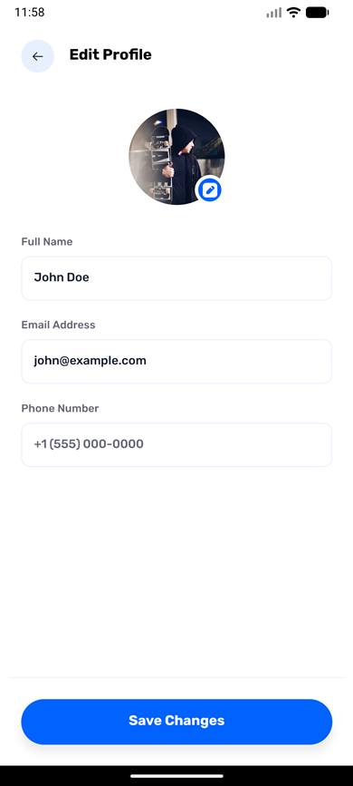
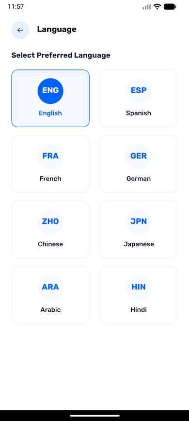
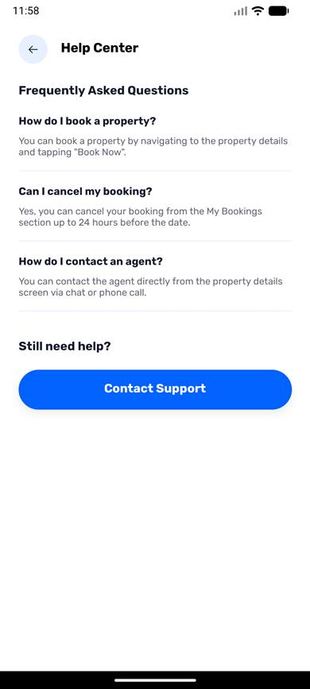
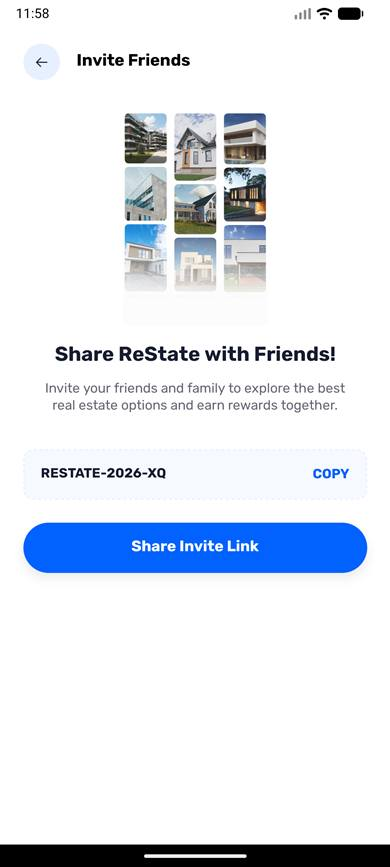

<h1 align="center">
  <br/>
  trurEstate
</h1>

<p align="center">
  <strong>A modern, full-featured real estate app built with React Native &amp; Expo</strong><br/>
  Browse properties, view detailed listings, book viewings, and manage your profile — all in one place.
</p>

<p align="center">
  
  
  
  
  
</p>

---

## 📱 App Screenshots

### 🔐 Sign In
> Elegant onboarding with Google OAuth — property image grid sets the scene instantly.

<p align="center">
  
</p>

---

### 🔍 Explore Properties
> Search and filter through all listings by type — Houses, Condos, Duplexes, Studios & more.

<p align="center">
  
</p>

---

### 🏡 Property Details
> Full property view with image gallery, beds/baths/sqft, agent info, facilities, map & reviews.

<p align="center">
  
  &nbsp;&nbsp;
  
</p>

---

### ✅ Booking Confirmation
> Instant booking confirmation with nights booked and total charge summary.

<p align="center">
  
</p>

---

### 👤 User Profile
> Manage your profile, bookings, payments, notifications, security, and more.

<p align="center">
  
  &nbsp;&nbsp;
  
</p>

---

### ⚙️ Settings & Preferences

<p align="center">
  
  &nbsp;
  
  &nbsp;
  
</p>

<p align="center">
  
  &nbsp;
  
  &nbsp;
  
</p>

---

## ✨ Features

- 🔐 **Google OAuth** — One-tap sign-in via Appwrite auth
- 🏘️ **Property Listings** — Browse Houses, Condos, Duplexes, Studios, and more
- 🔎 **Search & Filter** — Debounced real-time search with category filters
- 🏡 **Property Details** — Gallery, amenities, agent info, interactive map & user reviews
- 📅 **Booking System** — Book properties with instant confirmation screen
- 💳 **Payments** — Manage saved payment methods
- 🔔 **Notifications** — Configure Push, Email, SMS & promotional alert preferences
- 🌐 **Language Selector** — Multi-language support ready
- 🔒 **Security Settings** — Account security and password management
- 👥 **Invite Friends** — Built-in referral / invite screen
- 👤 **Profile Management** — Edit avatar, name, and view booking history

---

## 🛠️ Tech Stack

| Layer | Technology |
|---|---|
| Framework | React Native 0.76 + Expo 52 |
| Navigation | Expo Router 4 (file-based routing) |
| Styling | NativeWind 4 (TailwindCSS for React Native) |
| Backend / Auth | Appwrite |
| Animations | React Native Reanimated 3 |
| Gestures | React Native Gesture Handler |
| Language | TypeScript 5.3 |
| Fonts | Rubik (Light → ExtraBold) |

---

## 🚀 Getting Started

### Prerequisites

- Node.js 18+
- [Expo Go](https://expo.dev/go) app on your phone **or** an Android/iOS emulator

### 1. Clone & Install

```bash
git clone https://github.com/NamanKyada01/trueEstate.git
cd trueEstate
npm install
```

### 2. Configure Environment

Create a `.env.local` file in the root:

```env
EXPO_PUBLIC_APPWRITE_ENDPOINT=https://cloud.appwrite.io/v1
EXPO_PUBLIC_APPWRITE_PROJECT_ID=your_project_id
EXPO_PUBLIC_APPWRITE_DATABASE_ID=your_database_id
EXPO_PUBLIC_APPWRITE_GALLERIES_COLLECTION_ID=your_collection_id
EXPO_PUBLIC_APPWRITE_REVIEWS_COLLECTION_ID=your_collection_id
EXPO_PUBLIC_APPWRITE_AGENTS_COLLECTION_ID=your_collection_id
EXPO_PUBLIC_APPWRITE_PROPERTIES_COLLECTION_ID=your_collection_id
EXPO_PUBLIC_APPWRITE_BUCKET_ID=your_bucket_id
```

### 3. Start the App

```bash
npx expo start
```

Scan the QR code with **Expo Go** or press:
- `a` — Android emulator
- `i` — iOS simulator
- `w` — Web browser

---

## 📁 Project Structure

```
trurEstate/
├── app/                    # Expo Router screens (file-based routing)
│   ├── (root)/             # Main app tabs & nested screens
│   ├── sign-in.tsx         # Authentication screen
│   └── _layout.tsx         # Root layout & providers
├── components/             # Reusable UI components
├── lib/                    # Appwrite config, hooks, utilities
├── constants/              # Colors, icons, seed data
├── assets/
│   ├── fonts/              # Rubik font family (6 weights)
│   └── images/             # Icons, splash screen, images
└── screenshots/
    └── compressed/         # Optimized screenshots (18–48 KB each)
```

---

## 📄 License

This project is for educational and portfolio purposes.

---

<p align="center">Built with ❤️ using React Native &amp; Expo</p>
